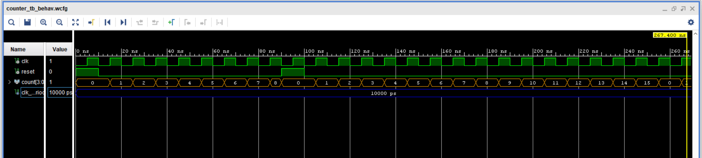

# 4-bit Counter

## Project Idea
This task implements a simple 4-bit asynchronous counter with reset.  
The counter increases its value by 1 on each rising edge of the clock. When reset is active, the counter value is cleared to zero.
---

## Function

**Inputs**
- `clk` : clock signal  
- `reset` : asynchronous reset signal  

**Output**
- `counter` : 4-bit binary number representing the current counter value
  
---

## Results
**Waveform**: shows the counter incrementing on each clock edge and after the reset the counter restarts from 0.

---
