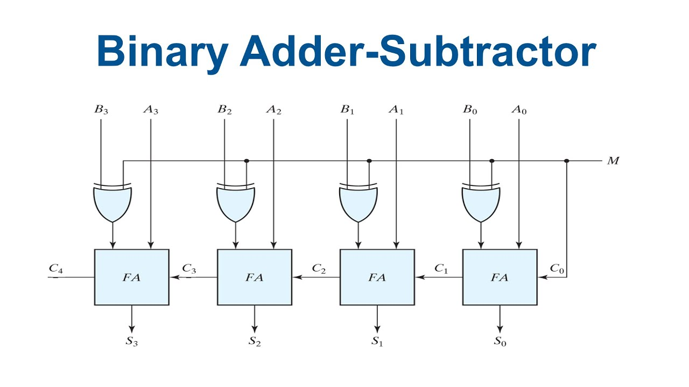
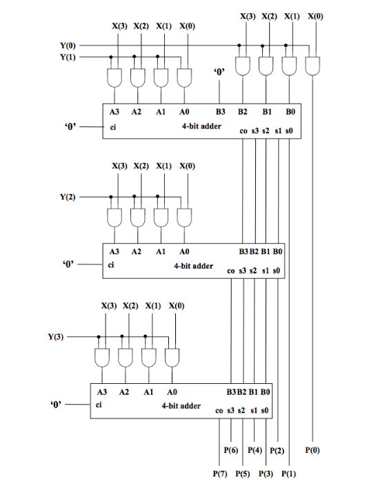
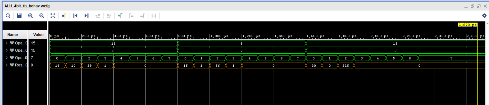
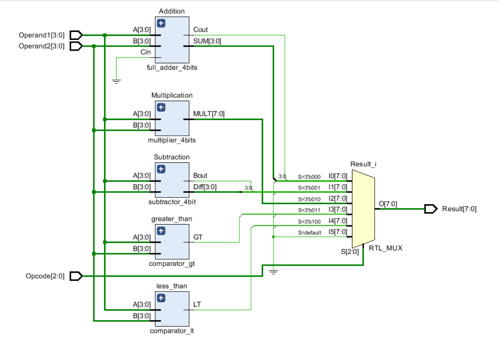

# 4-bit ALU (Structural Level)

## Project Idea

An Arithmetic Logic Unit (ALU) is a combinational digital circuit that performs arithmetic and bitwise operations on integer binary numbers. It is a fundamental component of processors.

The ALU takes two 4-bit operands and a 3-bit opcode as input. According to the opcode, it performs the operation and produces an 8-bit result.

---

## Function

**Inputs**

* `Operand1` : 4-bit binary number
* `Operand2` : 4-bit binary number
* `Opcode` : 3-bit binary number selecting the operation

**Output**

* `Result` : 8-bit binary number representing the result of the operation

---

## Opcode Table

| Opcode | Operation      | Result Description                       |
| ------ | -------------- | ---------------------------------------- |
| 000    | Addition       | Result = Operand1 + Operand2             |
| 001    | Subtraction    | Result = Operand1 - Operand2             |
| 010    | Multiplication | Result = Operand1 \* Operand2            |
| 011    | Greater Than   | Result = 1 if Operand1 > Operand2 else 0 |
| 100    | Less Than      | Result = 1 if Operand1 < Operand2 else 0 |
| others | No Operation   | Result = 0                               |

---

## Design Methodology

The ALU is designed by dividing the project into multiple blocks.

* **4-bit Adder**

  * Built using ripple-carry technique.
  * Constructed from four 1-bit full adders connected in series.

* **4-bit Subtractor**

  * Implemented using the full adder.
  * Operand2 is inverted and carry-in = 1 to perform subtraction.

* **4-bit Multiplier**

  * Implemented using multiple adders.
  * Partial products are generated by AND gates.
  * The results of partial products are accumulated using ripple-carry adders to form the 8-bit product.
 

* **Greater Than Comparator**

  * Operates by checking the most significant bit (MSB) first.
  * If Operand1’s MSB is greater than Operand2’s MSB, the output is 1.
  * If equal, comparison continues to the next lower bit until a difference is found.

* **Less Than Comparator**

  * Same logic as greater-than comparator.
  * Starts from MSB and moves down until a smaller bit is found.

---

## Result (Simulation Waveform)

Simulation waveform:

## Schematic

Schematic diagram of the design:

