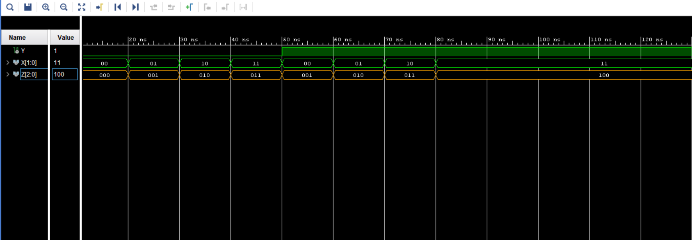
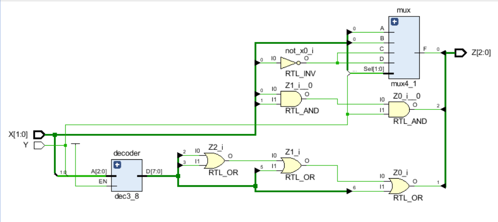

# 1-Bit + 2-Bit Adder Using Decoder and MUX
This task is a practice for **structural VHDL design**, connecting components to build a complete adder.

## Description
This task implements an **adder** for two variables:  
- `Y` (1-bit)  
- `X` (2-bit)  

The design uses a **3-to-8 decoder** (`dec3_8`) and a **4-to-1 multiplexer** (`mux4_1`) to generate 3-bit output `Z` representing the result of `Y + X`.

## Function
- Input:  
  - `Y` : 1-bit  
  - `X` : 2-bit  
- Output:  
  - `Z` : 3-bit sum  

## Truth Table

| Y | X1 | X0 | Z2 | Z1 | Z0 |
|---|----|----|----|----|----|
| 0 | 0  | 0  | 0  | 0  | 0  |
| 0 | 0  | 1  | 0  | 0  | 1  |
| 0 | 1  | 0  | 0  | 1  | 0  |
| 0 | 1  | 1  | 0  | 1  | 1  |
| 1 | 0  | 0  | 0  | 0  | 1  |
| 1 | 0  | 1  | 0  | 1  | 0  |
| 1 | 1  | 0  | 0  | 1  | 1  |
| 1 | 1  | 1  | 1  | 0  | 0  |

## Outputs
- **Z0** : Generated using the 4-to-1 multiplexer (`mux4_1`) based on `X(0)` and the selector from `Y` & `X(1)`.  
- **Z1** : Generated using the 3-to-8 decoder (`dec3_8`) by combining inputs `Y & X(1) & X(0)` and OR-ing the appropriate decoder outputs.  
- **Z2** : Generated directly by AND-ing all input bits (`Y & X(1) & X(0)`).

## Result (Simulation Waveform)

Simulation waveform:

## Schematic

Schematic diagram of the design:

