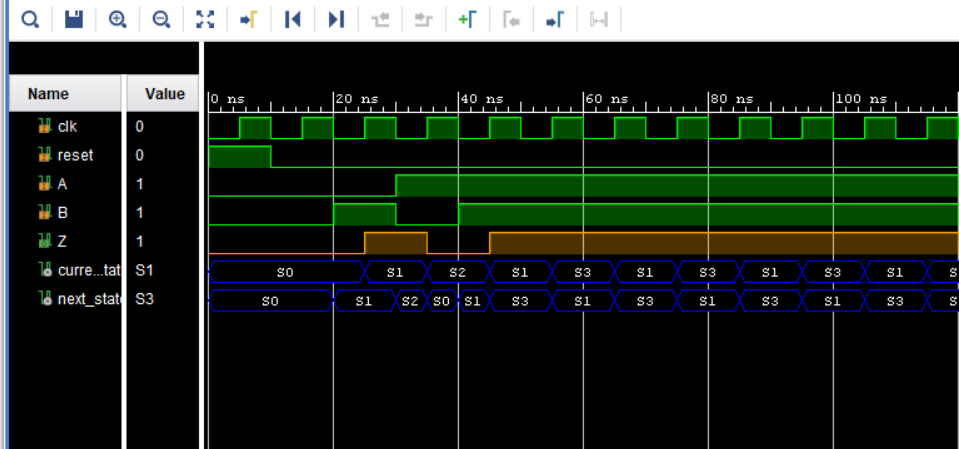

# Mealy FSM (AND-OR Switch) – VHDL Implementation

This is the **VHDL code** for the Mealy FSM (AND-OR switch).  
It is part of the main task available here:  
[`memory-proteus-projects/Mealy_AND_OR_FSM`](https://github.com/username/memory-proteus-projects/tree/main/Mealy_AND_OR_FSM)

## Description
- Implements the Mealy FSM using VHDL.
- FSM toggles between **AND** and **OR** operations based on the input signal `B`.

## Result (Simulation Waveform)

Simulation waveform:

