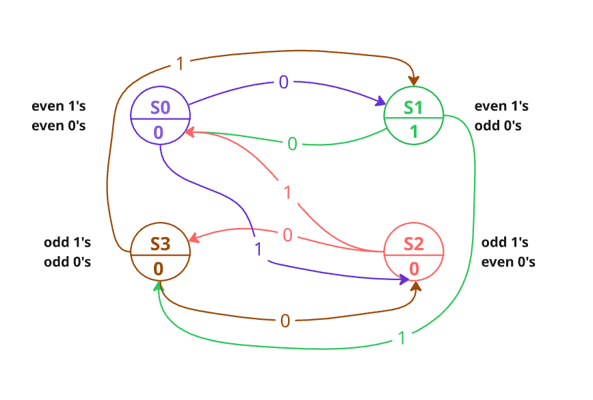
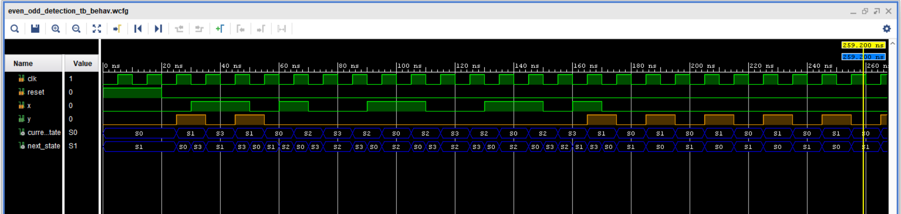

# FSM for Even '1's and Odd '0's Detection

## Description
This task implements a **Finite State Machine (FSM)** that recognizes any binary string containing:
- An **even number of '1's**
- An **odd number of '0's**

The FSM has four states, each representing the parity of the count of '1's and '0's so far.  
The machine outputs `y = 1` when the condition is satisfied.

## Function

### Inputs
- **clk**: Clock signal  
- **reset**: Reset signal (active high)  
- **x**: Serial input bit  

### Output
- **y**: Output signal, equals `1` only when the current state represents *even '1's and odd '0's*  

## State Definitions
- **S0**: Even 1s, Even 0s (Initial State)  
- **S1**: Even 1s, Odd 0s → **Accepting State** (y = 1)  
- **S2**: Odd 1s, Even 0s  
- **S3**: Odd 1s, Odd 0s

## State Diagram

## Result
- The FSM asserts the output `y = 1` only in **S1**.  
**Waveform**:

