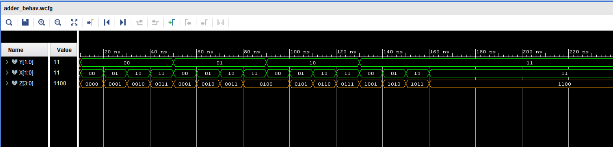

# Adder Circuit (x + y²) using decoder4_16 and mux4_1

## Description
This project implements a digital circuit that calculates the expression:

**z = x + y²**

- `x` is a 2-bit input  
- `y` is a 2-bit input  
- Maximum value of `z` is 12 (when x=3, y=3)

The design shows how the circuit handles inputs and generates the correct output.
---
## Truth table
| Y1 | Y0 | X1 | X0 | Z3 | Z2 | Z1 | Z0 | Z (dec) |
|----|----|----|----|----|----|----|----|---------|
| 0  | 0  | 0  | 0  | 0  | 0  | 0  | 0  | 0       |
| 0  | 0  | 0  | 1  | 0  | 0  | 0  | 1  | 1       |
| 0  | 0  | 1  | 0  | 0  | 0  | 1  | 0  | 2       |
| 0  | 0  | 1  | 1  | 0  | 0  | 1  | 1  | 3       |
| 0  | 1  | 0  | 0  | 0  | 0  | 0  | 1  | 1       |
| 0  | 1  | 0  | 1  | 0  | 0  | 1  | 0  | 2       |
| 0  | 1  | 1  | 0  | 0  | 0  | 1  | 1  | 3       |
| 0  | 1  | 1  | 1  | 0  | 1  | 0  | 0  | 4       |
| 1  | 0  | 0  | 0  | 0  | 1  | 0  | 0  | 4       |
| 1  | 0  | 0  | 1  | 0  | 1  | 0  | 1  | 5       |
| 1  | 0  | 1  | 0  | 0  | 1  | 1  | 0  | 6       |
| 1  | 0  | 1  | 1  | 0  | 1  | 1  | 1  | 7       |
| 1  | 1  | 0  | 0  | 1  | 0  | 0  | 1  | 9       |
| 1  | 1  | 0  | 1  | 1  | 0  | 1  | 0  | 10      |
| 1  | 1  | 1  | 0  | 1  | 0  | 1  | 1  | 11      |
| 1  | 1  | 1  | 1  | 1  | 1  | 0  | 0  | 12      |

---
## Outputs
- **Z0** : Generated using the 4-to-16 decoder (`dec4_16`) by combining inputs `Y & X` and OR-ing the appropriate decoder outputs.
- **Z1** : Generated using the 4-to-1 multiplexer (`mux4_1`) based on `X` and the selector from `Y`.  
- **Z2** : Generated using the 4-to-1 multiplexer (`mux4_1`) based on `X` and the selector from `Y`.
- **Z3** : Generated directly by AND-ing (`Y(1) & Y(0)`)

## Result (Simulation Waveform)

Simulation waveform:

