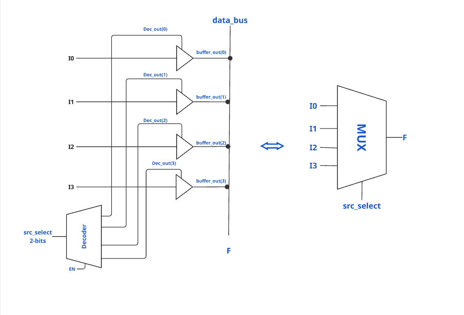
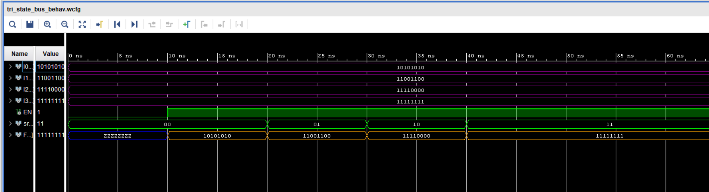

# Tri-State Bus 

## Project Idea

This task implements a tri-state bus that behaves like a multiplexer.  
It selects one of four 8-bit input signals (I0–I3) and drives it onto the output F based on a 2-bit select signal.  

The design uses a decoder to convert the 2-bit src_select into a 4-bit one-hot signal (Dec_out).  
Based on the decoder output, one of the inputs (I0–I3) is passed to the bus.  
If no valid input is selected or enable is inactive, the bus outputs high impedance(Z).

## Function

**Inputs**

- I0, I1, I2, I3: 8-bit input signals  
- src_select: 2-bit select signal  
- EN: Enable signal  

**Output**

- F: 8-bit output signal (driven with one of the inputs or high impedance)  

## Operation

The operation is controlled by src_select when EN = 1.  

- src_select = "00" → Output = I0  
- src_select = "01" → Output = I1  
- src_select = "10" → Output = I2  
- src_select = "11" → Output = I3  

If EN = 0 → Output = High impedance (Z)  

## Result (Simulation Waveform)

Simulation waveform:

